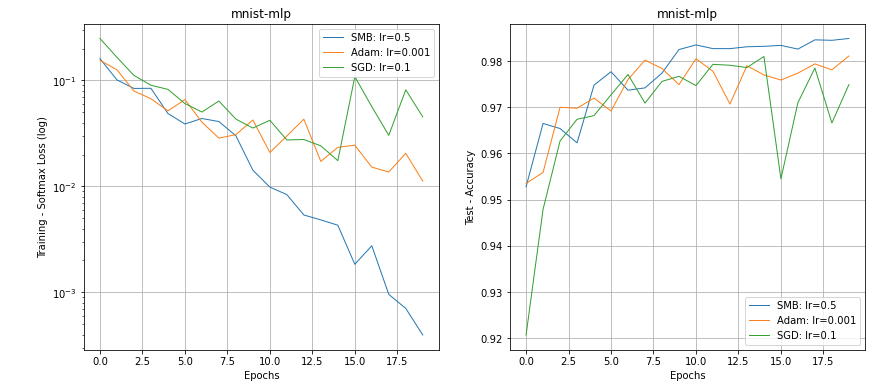

# Stochastic Model Building (SMB)

This repository includes a new fast and robust stochastic optimization algorithm for training deep learning models. The
core idea of the algorithm is based on building models with local stochastic gradient information. The details of the
algorithm is given in our [recent paper](https://arxiv.org/abs/2111.07058).



**Abstract**

Stochastic gradient descent method and its variants constitute the core optimization algorithms that achieve good
convergence rates for solving machine learning problems. These rates are obtained especially when these algorithms are
fine-tuned for the application at hand. Although this tuning process can require large computational costs, recent work
has shown that these costs can be reduced by line search methods that iteratively adjust the stepsize. We propose an
alternative approach to stochastic line search by using a new algorithm based on forward step model building. This model
building step incorporates a second-order information that allows adjusting not only the stepsize but also the search
direction. Noting that deep learning model parameters come in groups (layers of tensors), our method builds its model
and calculates a new step for each parameter group. This novel diagonalization approach makes the selected step lengths
adaptive. We provide convergence rate analysis, and experimentally show that the proposed algorithm achieves faster
convergence and better generalization in most problems. Moreover, our experiments show that the proposed method is quite
robust as it converges for a wide range of initial stepsizes.

_Keywords_: model building; second-order information; stochastic gradient descent; convergence analysis

## Installation

`pip install git+https://github.com/sibirbil/SMB.git`


## Usage
Here is how you can use SMB:

```python

from smbsolve.smb import SMB

optimizer = SMB(model.parameters(), independent_batch=False)  # independent_batch=True for SMBi optimizer

for epoch in range(100):

    # training steps
    model.train()

    for batch_index, (data, target) in enumerate(train_loader):
        # create loss closure for smb algorithm
        def closure():
            optimizer.zero_grad()
            loss = torch.nn.CrossEntropyLoss()(model(data), target)
            return loss


        # forward pass
        loss = optimizer.step(closure=closure)
```

Set the hyper-parameter `independent_batch` to `True` in order to use the `SMBi` optimizer.
Our [paper](http://www.optimization-online.org/DB_HTML/2021/11/8683.html) includes more information.
## Testing
### Reproducing paper experiments
This will run all optimizers on Cifar100 dataset for 200 epochs with densenet121 network. 

From commandline run:

```bash
$ reproduce_smb_paper
```

Results will be saved in your home directory inside smb_experiments folder. One can specify -o option to indicate save
path.

### Running custom experiments

Edit [sample_experiments_parameters.yaml](sample_experiments_parameters.yaml) file, (un-) comment lines according to the settings that you want to test.
Preferably rename your file to e.g my_test.yaml and run

```bash
$ run_smb_experiments -p my_test.yaml
```

One can add -o option to indicate directory path to save results and plots as above. Logs are saved under the home directory inside smb_experiments_logs folder.

**Plotting.**
While plots are automatically generated after running experiments, one can also provide a custom results folder (e.g. from old runs).

```bash
$ plot_smb_experiments -i path_to_experiment_results_folder
```

Here optional integer valued --epochs option can be added to restrict range to [0, epochs]. Moreover --opts option restrics plots to to given optimizers:

```bash
$ plot_smb_experiments -i path_to_experiment_results_folder --epochs 50 --opts SLS ADAM SMB
```

